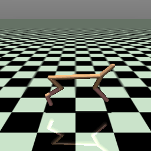
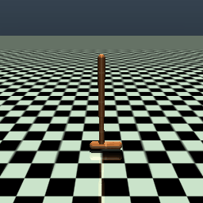
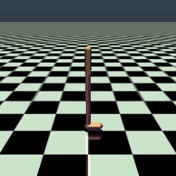

# Directly Forecasting Belief for Reinforcement Learning with Delays

### 0. requirements
    conda create -n dfbt python=3.10
    conda activate dfbt
    pip install -r requirement.yaml
    pip install "cython<3"
    pip install git+https://github.com/Farama-Foundation/d4rl@master#egg=d4rl

### 1. training directly forecasting belief

    python3 scripts/train_dfbt.py --dataset_name halfcheetah --delay 128

### 2. learning with directly forecasting belief

    python3 scripts/train_dfbt_sac.py --env_name HalfCheetah-v2 --delay 128

## Belief Visualization

<table>
    <thead>
        <tr>
            <th>Environment</th>
            <th>Truth</th>
            <th>DATS</th>
            <th>D-Dreamer</th>
            <th>D-SAC</th>
            <th>DBFT-SAC (ours)</th>
        </tr>
    </thead>
    <tbody>
        <tr>
            <td class="method-name">HalfCheetah-v2</td>
            <td></td>
            <td></td>
            <td></td>
            <td></td>
            <td></td>
        </tr>
    </tbody>
    <tbody>
        <tr>
            <td class="method-name">Hopper-v2</td>
            <td></td>
            <td></td>
            <td></td>
            <td></td>
            <td></td>
        </tr>
    </tbody>
    <tbody>
        <tr>
            <td class="method-name">Walker2d-v2</td>
            <td></td>
            <td></td>
            <td></td>
            <td></td>
            <td></td>
        </tr>
    </tbody>
</table>


## Citation
```
@inproceedings{wu2025directly,
  title={Directly Forecasting Belief for Reinforcement Learning with Delays},
  author={Wu, Qingyuan and Wang, Yuhui and Zhan, Simon Sinong and Wang, Yixuan and Lin, Chung-Wei and Lv, Chen and Zhu, Qi and Schmidhuber, J{\"u}rgen and Huang, Chao},
  booktitle={International Conference on Machine Learning},
  year={2025},
  organization={PMLR}
}
```


## Acknowledgement

1. CleanRL: https://github.com/vwxyzjn/cleanrl
2. SAC: https://github.com/haarnoja/sac
3. CORL: https://github.com/tinkoff-ai/CORL